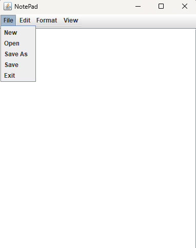
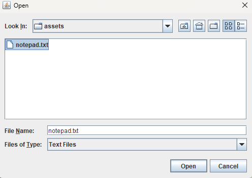
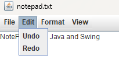
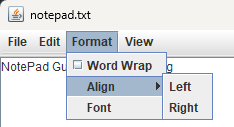
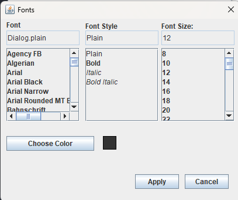
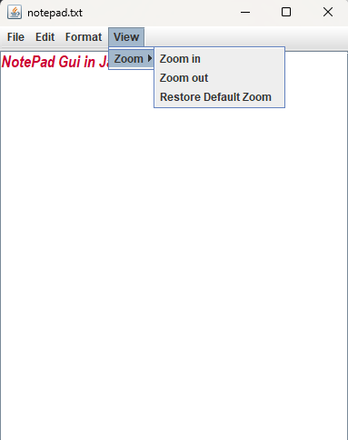

# NotePad in Java Swing
## Explanation

Notepad GUi built using Java and the Swing Framework. Allows user to perform a range of text editing task through a user friend graphical interface. 

# ScreenShots

